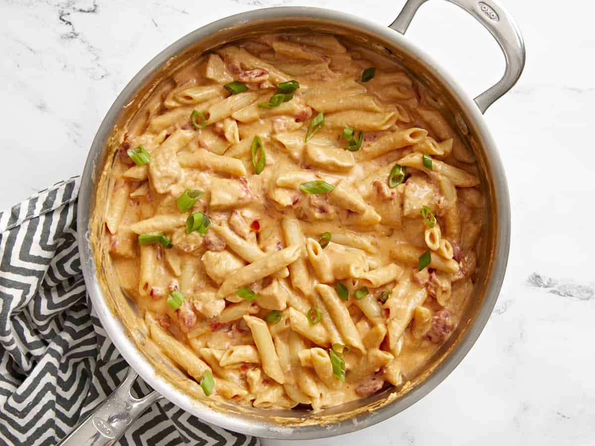

# Buffalo Chicken Pasta

[Recipe Link](https://www.budgetbytes.com/buffalo-chicken-pasta/)

### Ingredients List

1. 1 boneless, skinless chicken breast (about ⅔ lb.) 
1. 1/2 tsp garlic powder
1. 1/2 tsp onion powder
1. 1/2 tsp cayenne pepper
1. 1/4 tsp salt
1. 1 Tbsp cooking oil
1. 2 Tbsp butter
1. 8 oz. penne pasta
1. 1 15oz. can petite diced tomatoes 
1. 1.5 cups chicken broth
1. 4 oz. cream cheese
1. 1/4 cup hot sauce
1. 1/2 tsp Worcestershire sauce
1. 1/2 cup shredded Monterey jack cheese
1. 2 green onions, sliced (optional)

### Directions

1. Cut the chicken into ½-¾ inch pieces. Combine the garlic powder, onion powder, cayenne pepper, and salt, then sprinkle it over the chicken pieces. Toss the chicken in the spices until everything is well coated.
1. Heat the cooking oil in a large deep skillet over medium-high heat until very hot. Once hot, add the chicken and allow tge chicken to brown on all sides. The chicken does not need to be cooked through at this point.
1. Add the uncooked pasta, canned diced tomatoes (with the liquid), and the chicken broth to the skillet with the chicken. Stir to dissolve all of the browned bits off the bottom of the skillet.
1. Place a lid on the pot and allow the broth to come up to a strong simmer. The broth will not fully cover the pasta, but that is okay. Once the broth is simmering, briefly stir the pasta, replace the lid, then turn the heat down to medium-low.
1. Allow the pasta to simmer in the broth for 10-12 minutes or until the pasta is tender and most of the liquid has been absorbed, stirring once or twice throughout, and always replacing the lid after stirring.
1. Once the pasta is tender and only a small amount of thickened liquid remains in the skillet, cut the cream cheese into chunks and add it to the past along with the butter, hot sauce, and Worcestershire sauce. Stir and cook over medium-low heat until the cream cheese has fully melted into the pasta.
1. Add the shredded Monterey jack cheese and stir until melted into the sauce. Top with sliced green onions, then serve hot.

### Images

